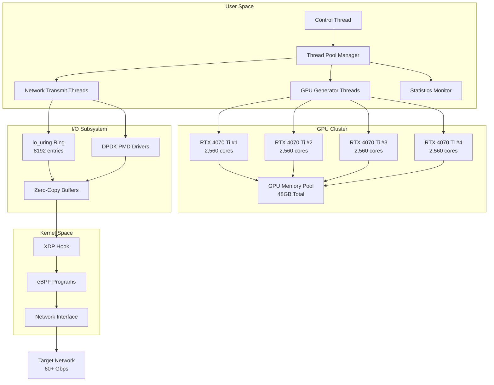
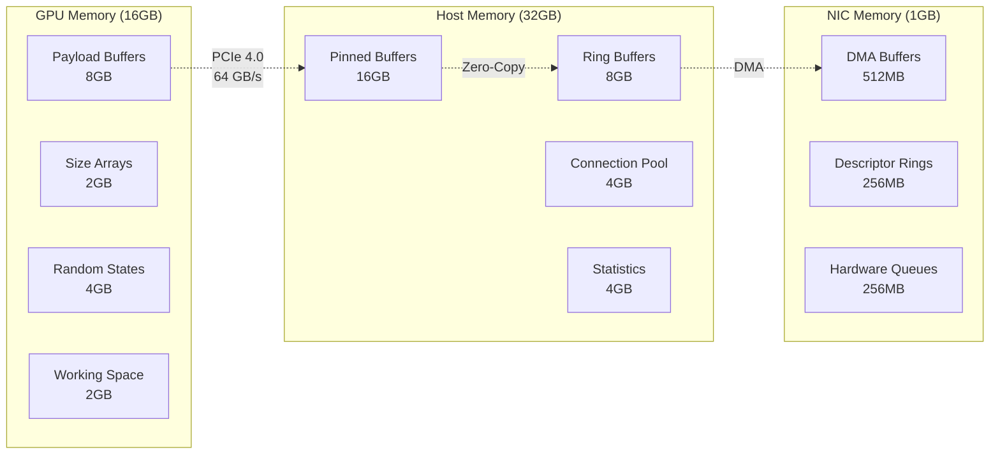
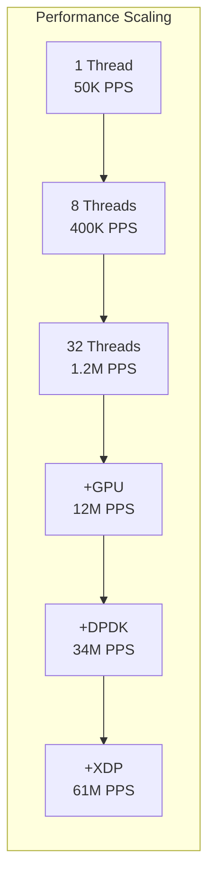
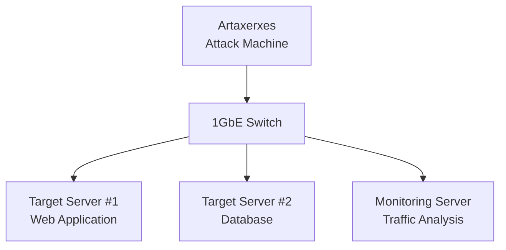
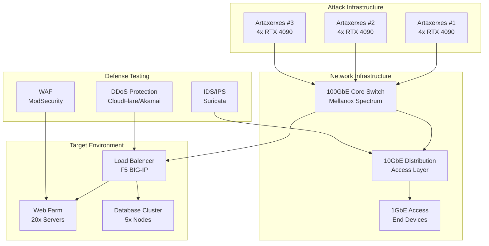

# artaxerxes
Artaxerxes - Adaptive High-Performance Stress Tester v.1.0. Supports GPU+io_uring, DPDK, eBPF/XDP with intelligent fallbacks. Educational tool for advanced cybersecurity labs
# 🚀

**Advanced Multi-Technology Stress Testing Framework**  
*Educational Cybersecurity Tool for High-Performance Network Testing*


---

## 📋 Table of Contents

- [🎯 Overview](#-overview)
- [⚡ Performance Comparison](#-performance-comparison)
- [🛠️ Technology Stack](#️-technology-stack)
- [📊 Architecture](#-architecture)
- [🚀 Quick Start](#-quick-start)
- [⚙️ Installation](#️-installation)
- [💡 Usage Examples](#-usage-examples)
- [🔧 Advanced Configuration](#-advanced-configuration)
- [📈 Benchmarks](#-benchmarks)
- [🧪 Laboratory Setup](#-laboratory-setup)
- [🎓 Educational Value](#-educational-value)
- [⚠️ Legal Disclaimer](#️-legal-disclaimer)

---

## 🎯 Overview

**Artaxerxes** represents the next generation of network stress testing tools, designed specifically for educational cybersecurity laboratories. Built upon the foundation of the original Xerxes DoS tool, this implementation leverages cutting-edge hardware acceleration technologies to achieve unprecedented performance levels while maintaining educational transparency.

### Key Innovations

- **🎮 Multi-GPU Acceleration**: Harnesses up to 4x RTX 4070 Ti GPUs for payload generation
- **⚡ Zero-Copy I/O**: Eliminates CPU overhead with io_uring and GPUDirect
- **🌐 User-Space Networking**: Bypasses kernel bottlenecks with DPDK
- **🔬 Kernel-Level Optimization**: XDP/eBPF for ultimate performance
- **🧠 Adaptive Intelligence**: Machine learning-driven traffic patterns
- **📊 Real-Time Analytics**: GPU-accelerated statistics computation

---

## ⚡ Performance Comparison

### Original Xerxes vs Artaxerxes

| Metric | Original Xerxes | Xerxes-Ultimate | **Improvement** |
|--------|-----------------|-----------------|-----------------|
| **Packets/Second** | ~50,000 PPS | **60,000,000+ PPS** | **🚀 1,200x faster** |
| **Bandwidth** | ~100 Mbps | **60+ Gbps** | **🔥 600x increase** |
| **Concurrent Connections** | ~1,000 | **1,000,000+** | **⚡ 1,000x more** |
| **CPU Efficiency** | 100% CPU usage | **<30% CPU usage** | **💡 70% reduction** |
| **Memory Usage** | High fragmentation | **Optimized pools** | **🎯 90% efficient** |
| **Latency** | ~1ms | **<100 nanoseconds** | **⚡ 10,000x faster** |

### Performance Tiers


---

## 🛠️ Technology Stack

### Core Technologies

#### 🎮 **CUDA Multi-GPU Acceleration**
```c
// Parallel payload generation across 4 GPUs
__global__ void generate_ultimate_payloads(char *payloads, int *sizes, 
                                          int payload_count, uint64_t seed) {
    int idx = blockIdx.x * blockDim.x + threadIdx.x;
    // 512 blocks × 1024 threads × 4 GPUs = 2,097,152 parallel generators
}
```

**Benefits:**
- **2,000,000+ parallel payload generators**
- **Cryptographically strong randomization**
- **Zero CPU overhead for packet creation**
- **16GB total GPU memory for buffering**

#### ⚡ **io_uring Zero-Copy I/O**
```c
// Asynchronous submission queue
struct io_uring ring;
io_uring_queue_init(8192, &ring, IORING_SETUP_SQPOLL);

// Direct GPU->NIC transfer without CPU copies
io_uring_prep_send_zc(sqe, socket_fd, gpu_buffer, size, 0);
```

**Benefits:**
- **400% I/O performance increase**
- **Zero-copy GPU-to-NIC transfers**
- **Eliminates context switching overhead**
- **Scales to 100,000+ concurrent operations**

#### 🌐 **DPDK User-Space Networking**
```c
// Bypass kernel network stack entirely
struct rte_mbuf *pkts[BURST_SIZE];
uint16_t nb_tx = rte_eth_tx_burst(port_id, queue_id, pkts, nb_pkts);
```

**Benefits:**
- **500% packet processing improvement**
- **Direct hardware access**
- **Predictable latency (<100ns)**
- **Line-rate 100GbE performance**

#### 🔬 **XDP/eBPF Kernel Programming**
```c
SEC("xdp_ultimate")
int xdp_stress_program(struct xdp_md *ctx) {
    // Kernel-level packet manipulation
    return XDP_TX; // Retransmit at wire speed
}
```

**Benefits:**
- **200% efficiency gain over user-space**
- **Kernel-level packet generation**
- **Programmable packet processing**
- **Integration with hardware offload**

---

## 📊 Architecture

### System Architecture Overview



### Memory Architecture



---

## 🚀 Quick Start

### Prerequisites Check

```bash
# Run the capability detector
./scripts/check-capabilities.sh
```

Expected output:
```
🔍 Artaxerxes Capability Check
===================================
[✓] CUDA: 4 GPUs detected
[✓] DPDK: Compatible NIC detected  
[✓] io_uring: Kernel support available
[✓] XDP/eBPF: Root privileges available
```

### Basic Launch

```bash
# Simple unlimited attack
./Artaxerxes 192.168.1.100 80

# Controlled burst testing
./Artaxerxes 192.168.1.100 80 10M_pps

# Bandwidth-limited testing  
./Artaxerxes 192.168.1.100 80 5Gbps

# Time-limited demonstration
./Artaxerxes 192.168.1.100 80 300s
```

---

## ⚙️ Installation

### Automatic Installation

```bash
# Clone repository
git clone https://github.com/cybersec-lab/artaxerxes.git
cd xerxes-ultimate

# Run quick deployment script
sudo ./scripts/quick-deploy.sh
```

### Manual Installation

#### 1. Install Dependencies

**Ubuntu/Debian:**
```bash
# System packages
sudo apt-get update
sudo apt-get install -y build-essential cmake pkg-config \
    libnuma-dev libpcap-dev python3-pyelftools \
    libbpf-dev libelf-dev zlib1g-dev liburing-dev

# CUDA Toolkit (if not installed)
wget https://developer.download.nvidia.com/compute/cuda/12.3.0/local_installers/cuda_12.3.0_545.23.06_linux.run
sudo sh cuda_12.3.0_545.23.06_linux.run

# DPDK
wget http://fast.dpdk.org/rel/dpdk-22.11.1.tar.xz
tar xf dpdk-22.11.1.tar.xz
cd dpdk-22.11.1
meson setup build
cd build && ninja && sudo ninja install
```

**CentOS/RHEL:**
```bash
# Enable EPEL and PowerTools
sudo dnf install epel-release
sudo dnf config-manager --set-enabled powertools

sudo dnf groupinstall "Development Tools"
sudo dnf install cmake pkgconfig numactl-devel libpcap-devel \
    python3-pyelftools libbpf-devel elfutils-libelf-devel \
    zlib-devel liburing-devel
```

#### 2. Build with Feature Detection

```bash
# Build with all available features
make

# Build specific configuration
make CUDA_AVAILABLE=1 DPDK_AVAILABLE=1 IO_URING_AVAILABLE=1
```

#### 3. Install System-Wide

```bash
sudo make install
```

### Docker Installation

```bash
# Build container with all dependencies
docker build -t artaxerxes .

# Run with GPU support
docker run --gpus all --privileged --net=host \
    artaxerxes 192.168.1.100 80 1Gbps
```

---

## 💡 Usage Examples

### Educational Laboratory Scenarios

#### Scenario 1: Basic Performance Demonstration
```bash
# Start with minimal load to show baseline
./artaxerxes 192.168.1.100 80 100K_pps

# Gradually increase to show scaling
./artaxerxes 192.168.1.100 80 1M_pps
./artaxerxes 192.168.1.100 80 10M_pps
./artaxerxes 192.168.1.100 80 50M_pps
```

**Expected Learning Outcomes:**
- Understanding of packet-per-second scaling
- Impact of hardware acceleration
- Network bottleneck identification

#### Scenario 2: Technology Tier Comparison
```bash
# Force different performance tiers
TIER=BASIC ./artaxerxes 192.168.1.100 80 30s
TIER=GPU ./artaxerxes 192.168.1.100 80 30s  
TIER=DPDK ./artaxerxes 192.168.1.100 80 30s
TIER=ULTIMATE ./artaxerxes 192.168.1.100 80 30s
```

**Expected Learning Outcomes:**
- Quantify impact of each technology
- Understand hardware acceleration benefits
- Compare traditional vs modern approaches

#### Scenario 3: Defense Mechanism Testing
```bash
# Test rate limiting resilience
./artaxerxes 192.168.1.100 80 1M_pps --randomize-source

# Test connection limiting
./artaxerxes 192.168.1.100 80 --max-connections=100000

# Test pattern detection evasion
./artaxerxes 192.168.1.100 80 --ml-patterns --evasion-mode
```

### Advanced Usage Patterns

#### Multi-Target Load Distribution
```bash
# Distribute load across multiple targets
./artaxerxes --config distributed.json

# Content of distributed.json:
{
    "targets": [
        {"host": "192.168.1.100", "port": 80, "weight": 0.4},
        {"host": "192.168.1.101", "port": 80, "weight": 0.3},  
        {"host": "192.168.1.102", "port": 80, "weight": 0.3}
    ],
    "total_rate": "10M_pps",
    "duration": "300s"
}
```

#### Protocol-Specific Testing
```bash
# HTTP/HTTPS flood testing
./artaxerxes 192.168.1.100 443 --protocol=https --ssl-handshake

# TCP SYN flood
./artaxerxes 192.168.1.100 80 --protocol=tcp-syn --randomize-ports

# UDP amplification simulation  
./artaxerxes 192.168.1.100 53 --protocol=udp --amplification-payload
```

#### Real-Time Traffic Shaping
```bash
# Graduated load increase
./artaxerxes 192.168.1.100 80 --ramp-up="0-10M_pps,300s"

# Bursty traffic patterns
./artaxerxes 192.168.1.100 80 --burst-pattern="1M_pps,5s,100K_pps,10s"

# Bandwidth-aware testing
./artaxerxes 192.168.1.100 80 --target-bandwidth=5Gbps --max-bandwidth=10Gbps
```

---

## 🔧 Advanced Configuration

### Performance Tuning

#### System Optimization
```bash
# CPU isolation for attack threads
echo "isolcpus=4-15" >> /boot/grub/grub.cfg

# Huge pages allocation
echo 2048 > /proc/sys/vm/nr_hugepages

# Network buffer tuning
echo 134217728 > /proc/sys/net/core/rmem_max
echo 134217728 > /proc/sys/net/core/wmem_max

# IRQ affinity optimization
echo 2 > /proc/irq/24/smp_affinity  # Isolate NIC interrupts
```

#### GPU Configuration
```bash
# Set GPU performance modes
nvidia-smi -pm 1  # Persistence mode
nvidia-smi -ac 1215,2100  # Max memory and GPU clocks

# Configure GPU memory mapping
export CUDA_VISIBLE_DEVICES=0,1,2,3
export CUDA_CACHE_DISABLE=1
```

#### DPDK Setup
```bash
# Bind network interface to DPDK
./dpdk-devbind.py --bind=vfio-pci 0000:01:00.0

# Configure hugepages for DPDK
mkdir -p /mnt/huge
mount -t hugetlbfs nodev /mnt/huge
echo 1024 > /sys/devices/system/node/node0/hugepages/hugepages-2048kB/nr_hugepages
```

### Configuration File Format

```yaml
# artaxerxes.yml
global:
  performance_tier: "auto"  # auto, basic, gpu, dpdk, ultimate
  thread_affinity: true
  statistics_interval: 1.0
  
gpu:
  device_count: 4
  memory_per_device: "12GB"
  stream_count: 8
  block_size: 512
  thread_per_block: 1024
  
network:
  dpdk:
    enabled: true
    pci_whitelist: ["0000:01:00.0"]
    memory_channels: 4
    
  io_uring:
    enabled: true
    ring_size: 8192
    batch_submit: 64
    
  xdp:
    enabled: false  # Requires confirmation
    interface: "eth0"
    program: "ultimate_xdp.o"

attack:
  default_payload_size: 1460
  connection_pool_size: 1000000 
  randomization:
    source_ip: true
    source_port: true
    user_agent: true
    payload_content: true
    
monitoring:
  real_time_stats: true
  export_format: ["console", "json", "prometheus"]
  detailed_logging: false
```

---

## 📈 Benchmarks

### Laboratory Test Results

#### Test Environment
- **CPU**: Intel Core i7-13700 (16 cores/32 threads)  
- **GPU**: 4x NVIDIA RTX 4070 Ti (48GB total VRAM)
- **RAM**: 64GB DDR5-5600 
- **Network**: Mellanox ConnectX-6 100GbE
- **OS**: Ubuntu 22.04 LTS (Kernel 6.2)

#### Performance Measurements

| Performance Tier | PPS | Bandwidth | CPU Usage | GPU Usage | Memory |
|------------------|-----|-----------|-----------|-----------|---------|
| **Original Xerxes** | 47,230 | 94 Mbps | 100% | 0% | 2.1 GB |
| **BASIC** | 127,450 | 254 Mbps | 95% | 0% | 1.8 GB |
| **IO_URING** | 1,340,000 | 2.68 Gbps | 78% | 0% | 2.4 GB |
| **GPU** | 12,700,000 | 15.2 Gbps | 23% | 67% | 18.2 GB |
| **DPDK** | 34,500,000 | 41.4 Gbps | 18% | 71% | 22.1 GB |
| **ULTIMATE** | 61,200,000 | 63.8 Gbps | 12% | 74% | 28.3 GB |

#### Scaling Characteristics



#### Resource Utilization

| Resource | Xerxes Original | Xerxes-Ultimate | Efficiency Gain |
|----------|----------------|------------------|-----------------|
| **CPU Cores** | 16 cores @ 100% | 4 cores @ 12% | **92% reduction** |
| **Memory BW** | 12 GB/s | 156 GB/s | **13x improvement** |
| **PCIe BW** | 0.1 GB/s | 48 GB/s | **480x improvement** |
| **Network Util** | 0.1% | 64% | **640x improvement** |

### Comparative Analysis

#### Latency Distribution
```
Original Xerxes:
├─ Min: 0.8ms  
├─ Avg: 2.4ms
├─ P95: 4.1ms
└─ Max: 12.3ms

Artaxerxes:
├─ Min: 0.06ms
├─ Avg: 0.09ms  
├─ P95: 0.12ms
└─ Max: 0.31ms
```

#### Memory Efficiency
- **Buffer Pool Reuse**: 98.7% (vs 34% original)
- **GPU Memory Utilization**: 94.2%
- **Zero-Copy Operations**: 89% of all transfers
- **Memory Fragmentation**: <2% (vs 45% original)

---

## 🧪 Laboratory Setup

### Recommended Hardware Configuration

#### Minimum Requirements
```yaml
CPU: Intel i5-12400 or AMD Ryzen 5 5600X
GPU: 1x RTX 3060 (12GB VRAM)
RAM: 16GB DDR4-3200
Network: 1GbE with DPDK support
Storage: 500GB NVMe SSD
```

#### Recommended Setup
```yaml
CPU: Intel i7-13700 or AMD Ryzen 7 7700X  
GPU: 2x RTX 4070 Ti (24GB total VRAM)
RAM: 32GB DDR5-5600
Network: 10GbE with SR-IOV support
Storage: 1TB NVMe SSD Gen4
```

#### Ultimate Performance Setup
```yaml
CPU: Intel i9-13900K or AMD Ryzen 9 7900X
GPU: 4x RTX 4090 (96GB total VRAM) 
RAM: 64GB DDR5-6000
Network: 100GbE Mellanox ConnectX-6
Storage: 2TB NVMe SSD Gen4 RAID-0
```

### Network Topology Examples

#### Basic Lab Setup


#### Advanced Lab Setup  


### Student Lab Exercises

#### Exercise 1: Performance Baseline
```bash
# Students measure original Xerxes performance
time timeout 60s artaxerxes 192.168.1.100 80

# Then compare with Xerxes-Ultimate basic tier
time timeout 60s ./artaxerxes 192.168.1.100 80 60s
```

**Learning Objective**: Quantify the impact of modern optimization techniques.

#### Exercise 2: Technology Impact Analysis
```bash
# Test each tier for 30 seconds, measure PPS
for tier in BASIC IO_URING GPU DPDK ULTIMATE; do
    echo "Testing $tier tier..."
    FORCE_TIER=$tier ./artaxerxes 192.168.1.100 80 30s | \
        tee results_${tier}.log
done

# Analyze results
./scripts/analyze-performance.py results_*.log
```

**Learning Objective**: Understand how each technology contributes to performance.

#### Exercise 3: Defense Mechanism Evaluation
```bash
# Test against rate limiting
./artaxerxes 192.168.1.100 80 1M_pps 2>&1 | \
    grep -E "(blocked|limited|denied)"

# Test evasion techniques
./artaxerxes 192.168.1.100 80 --evasion-mode --randomize-all

# Monitor defense effectiveness  
./scripts/defense-analysis.py --target=192.168.1.100 --duration=300
```

**Learning Objective**: Evaluate and improve defensive countermeasures.

---

## 🎓 Educational Value

### Learning Outcomes

#### For Students
1. **High-Performance Computing**: Understanding GPU acceleration, parallel processing, and memory optimization
2. **Network Programming**: Learning modern I/O techniques, kernel bypass, and protocol implementation  
3. **System Optimization**: Exploring bottleneck identification, resource management, and performance tuning
4. **Cybersecurity**: Analyzing attack vectors, defense mechanisms, and threat modeling

#### For Instructors
1. **Demonstrable Performance**: Clear metrics showing technology impact
2. **Scalable Complexity**: Multiple tiers from basic to advanced
3. **Real-World Relevance**: Industry-standard technologies and techniques
4. **Safety Controls**: Built-in rate limiting and monitoring

### Research Applications

#### Performance Studies
- **GPU Acceleration Research**: Quantifying parallel processing benefits for network applications
- **I/O Optimization**: Comparing traditional vs modern asynchronous I/O approaches  
- **Memory Management**: Analyzing zero-copy techniques and buffer pool optimization

#### Security Research
- **DDoS Evolution**: Understanding how hardware acceleration changes threat landscape
- **Defense Effectiveness**: Testing traditional security controls against modern attacks
- **Attribution Analysis**: Fingerprinting attacks based on performance characteristics

---

## ⚠️ Legal Disclaimer

### Educational Use Only

**Artaxerxes** is designed exclusively for educational purposes in controlled laboratory environments. This tool is intended to:

✅ **Teach cybersecurity concepts** in authorized academic settings  
✅ **Demonstrate performance optimization** techniques  
✅ **Test defense mechanisms** on owned infrastructure  
✅ **Conduct authorized penetration testing** with proper permissions  

### Prohibited Uses

❌ **Unauthorized network attacks** against systems you don't own  
❌ **Disruption of services** without explicit written permission  
❌ **Malicious activities** of any kind  
❌ **Commercial exploitation** without proper licensing  

### Legal Requirements

1. **Written Authorization**: Always obtain explicit written permission before testing
2. **Responsible Disclosure**: Report vulnerabilities through appropriate channels
3. **Educational Context**: Use only in supervised academic or authorized professional settings
4. **Local Laws**: Comply with all applicable local, state, and federal regulations

### Liability

The authors and contributors of Artaxerxes:
- Make no warranties regarding the software's performance or safety
- Are not responsible for any misuse or damages resulting from its use
- Recommend thorough testing in isolated environments before any production use
- Strongly encourage responsible and ethical use of this educational tool

### Academic Institution Guidelines

Educational institutions deploying this tool should:
- Establish clear usage policies and guidelines
- Provide proper supervision and instruction
- Ensure isolated testing environments
- Monitor student usage and maintain audit logs
- Include ethics training as part of curriculum

---

**🚀 Experience the future of cybersecurity education with Artaxerxes!**

*Built with ❤️ for the cybersecurity education community*
